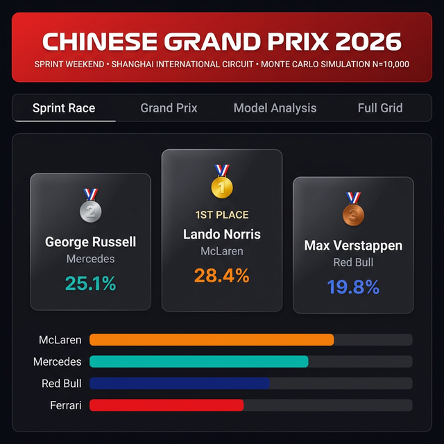
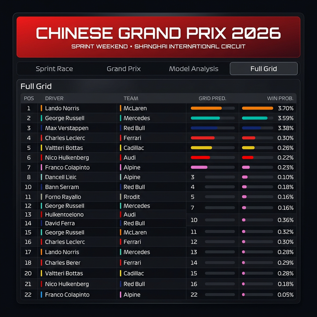

<div align="center">
  

  # 🏎️ F1 2026 Chinese GP Prediction Platform

  **An AI-driven prediction engine and simulation dashboard for the 2026 Formula 1 season.**

  [](https://streamlit.io/)
  [](https://www.python.org/downloads/)
  [](https://opensource.org/licenses/MIT)
</div>

---

## 🏁 Overview

Formula 1 generates massive volumes of telemetry and performance data during every race weekend. This project develops an AI-driven prediction platform capable of forecasting both the **Sprint Race** and **Main Grand Prix** winners for the **2026 Chinese Grand Prix** at the Shanghai International Circuit.

The system combines advanced machine learning techniques, including **LightGBM**, **XGBoost**, and **LambdaRank**, driven through a **10,000-run Monte Carlo Race Simulator**. 

It accounts for the *real* 2026 22-car grid (including new entrants Audi and Cadillac) and actively incorporates live Free Practice 1 (FP1) pace data to deliver highly calibrated, probabilistic race outcomes.

<div align="center">
  
</div>

---

## 🚀 Features

- **5-Layer ML Pipeline**:
  - `Sprint Model` (LightGBM Classifier): Predicts the explosive Saturday Sprint winners.
  - `Pace Model` (LightGBM Regressor): Forecasts expected race lap times base on skill and constructor pace.
  - `Ranking Model` (LambdaMART): Predicts full top-to-bottom finishing orders.
  - `Strategy Model` (XGBoost): Estimates pit stops and tire degradation curves over a stint.
  - `Monte Carlo Simulator`: Runs 10,000+ simulated races with stochastic events (Safety Cars, Weather, DNFs).
- **Verified 2026 Grid Data**: Includes Audi, Cadillac, and the latest rookie lineups (Antonelli, Bearman, Colapinto, Lindblad).
- **Dynamic FP1 Integration**: Programmatically adjusts constructor and driver pace indices based on real Friday FP1 lap times.
- **Premium Dashboard**: A highly polished, interactive dark-mode UI built in Streamlit.

---

## 🛠️ Installation & Setup

Ensure you have Python 3.10+ installed on your system.

1. **Clone the repository**:
   ```bash
   git clone https://github.com/yourusername/f1-prediction-2026.git
   cd f1-prediction-2026
   ```

2. **Install dependencies**:
   ```bash
   pip install -r requirements.txt
   ```

3. **Launch the Dashboard**:
   ```bash
   streamlit run app.py
   ```
   Open `http://localhost:8501` in your browser.

---

## 📂 Project Architecture

```
f1-prediction-2026/
├── app.py                        # Main Streamlit Dashboard UI
├── requirements.txt              # Project dependencies
├── assets/                       # UI preview images
└── src/
    ├── config.py                 # F1 2026 Grid, Drivers, Track Configs
    ├── data/
    │   ├── data_generator.py     # Generates synthetic historical F1 data
    │   └── features.py           # Feature engineering & FP1 integration
    └── models/
        ├── sprint_model.py       # Sprint probability classifier
        ├── pace_model.py         # Race lap pace regressor
        ├── ranking_model.py      # LambdaRank finishing order
        ├── strategy_model.py     # Pit stop & tire strategy predictor
        └── monte_carlo.py        # 10,000-run lap-by-lap simulator
```

---

## 📊 Live Simulation Highlights

Based on our March 13, 2026 FP1 pace data (where Mercedes locked out a 1-2):
- **George Russell** sits as the heavy favorite for the Grand Prix (~45% Win Prob).
- **Lando Norris** retains an edge on long-run consistency, predicted to outpace Antonelli on Sunday.
- **Max Verstappen** and Red Bull need to find 0.5s of pace overnight to challenge the podium.

*Run the dashboard and tweak the **Random Seed** in the sidebar to simulate alternate chaotic weather or Safety Car scenarios!*

---

> **Disclaimer**: This is a demonstrative AI analytics project. Outcomes are probabilistic predictions based on data models, intended for educational/analytical display.
